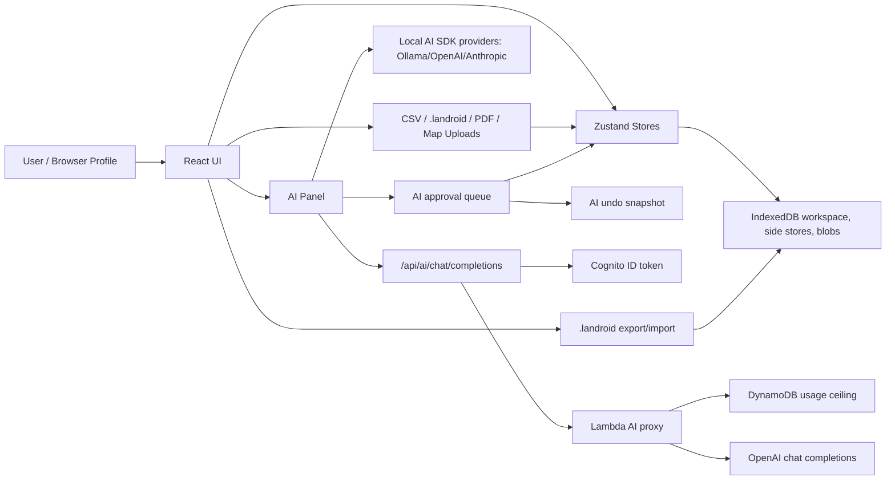

# LANDroid AI, Security, Structural, and Performance Audit

Date: 2026-05-20
Branch: `codex/audit-pass-a-2026-05-20`
Scope: repository root app, AI layer, hosted AI proxy, local storage/import/export,
document handling, math/state flows, CI/docs/deployment posture.

This is Pass A, written so it can be compared directly against a second
independent audit. The key conclusion is that LANDroid has a useful safety
foundation for local-first AI, but the requested AI runsheet workflow is not
yet a product-grade assistant. The next AI phase should build the import flow as
a structured, approval-gated workflow instead of relying on free-form chat to
call tools row by row.

## Executive Summary

No P0 issue was found in this static/source audit. The strongest existing
controls are:

- Cloud provider API keys are session-only in the browser and the hosted proxy
keeps server-held keys behind Cognito ID-token verification.
- Hosted AI currently has no mutating tools in the client path.
- Local mutating AI tools queue proposals and require user approval.
- Binary Excel parsing has been removed from the AI import path; CSV parsing is
worker-backed and capped.
- Document-registry PDF uploads are magic-byte checked, normalized to
`application/pdf`, and sandboxed in previews.
- There were no active `innerHTML`, `dangerouslySetInnerHTML`, `eval`,
`new Function`, or `document.write` sinks found in active `src`/backend code.

The highest priority risks are:

1. AI undo can silently snapshot an empty document workspace if document export
   fails, making a later undo capable of wiping document records.
2. The AI approval/result loop does not feed approved tool IDs/results back into
   future model context, which breaks multi-step AI flows like owner -> node ->
   lease -> attachment.
3. The approval UI is too thin for beginner-safe title/math edits; it lacks a
   structured diff and validation preview.
4. The desired runsheet assistant does not exist end to end. Current pieces
   parse/stage rows or create desk maps, but do not guide document attachment,
   owner creation, lease creation, row-level questions, and graph mutations in
   one durable workflow.
5. The hosted proxy is broader than the hosted UI needs; any signed-in token can
   submit a generic capped OpenAI chat body, including tool schemas, even though
   hosted LANDroid does not execute those tools.
6. `.landroid` import and side-store replacement can leave mixed or stale state
   if document/owner/map/research replacement fails after the core workspace is
   loaded.
7. A focused leasehold transfer-order path can include unit-wide ORRI/WI records
   without enough unit/tract filtering.

## Severity Legend

- P0: active exploit/data loss likely under current normal use.
- P1: fix before building the next AI phase, broader hosted exposure, or real
  title-data reliance.
- P2: fix in the hardening backlog; important but less likely to cause immediate
  loss alone.
- P3: cleanup, performance, or consistency improvement.

## System And Trust Boundary Map

Main trust boundaries:

- Imported files are untrusted, including CSV cells, `.landroid` JSON, PDFs,
  map assets, GeoJSON, and future OCR text.
- Cloud AI providers can receive sensitive project/title context when the user
  selects cloud AI.
- Hosted Cognito protects app access, but the Lambda Function URL is still auth
  type `NONE`; the handler's token verification is the security boundary.
- IndexedDB is local browser state, not a multi-user backend database.
- AI tool proposals are untrusted until reviewed by the user and applied through
  known store actions.

## Flow Maps

### Local Normal Edit Flow

1. User acts in a view or modal.
2. Component calls a focused Zustand store action.
3. Store action delegates math, validation, persistence, or cleanup helpers.
4. Store state updates.
5. Autosave persists workspace/canvas/side-store data to IndexedDB.
6. Derived views re-render.

This is consistent with `ARCHITECTURE.md:55-68`.

### Local AI Mutation Flow

1. User sends a prompt in `AIPanel`.
2. `runChat` calls `streamText` with `LANDROID_SYSTEM_PROMPT` and
   `landroidTools` (`src/ai/runChat.ts:64-73`).
3. Mutating tools have been wrapped so their execute path returns an approval
   proposal instead of mutating immediately (`src/ai/tools.ts:956-970`).
4. The approval card shows summary/tool name and waits for user approval
   (`src/ai/AIPanel.tsx:408-454`).
5. `approveAIProposal` executes the original tool and captures one undo
   snapshot (`src/ai/approval-store.ts`, `src/ai/undo-store.ts:76-108`).
6. A successful approval is appended to chat as assistant text plus tool call
   result (`src/ai/AIPanel.tsx:78-94`).

Key gap: future model turns only receive `ChatEntry.text`, not the structured
tool output (`src/ai/AIPanel.tsx:127-130`). The model loses IDs and validation
results it needs for chained work.

### Hosted AI Flow

1. Client obtains Cognito ID token and posts to `/api/ai/chat/completions`
   (`src/ai/runChat.ts:151-176`).
2. The client includes the LANDroid system prompt and read-only app context
   (`src/ai/runChat.ts:170-173`).
3. The Lambda proxy verifies the bearer token, caps body size, applies body
   policy, estimates tokens, records usage, and forwards to OpenAI
   (`backend/ai-proxy/src/handler.ts:128-185`).
4. Hosted client parses streamed text and returns no tool calls
   (`src/ai/runChat.ts:193-236`).

Key gap: hosted mode is intentionally read-only today. It cannot safely support
"AI builds the graph line by line" until a hosted proposal/apply/undo protocol
exists.

### CSV / Runsheet Flow

1. User uploads a CSV into the AI wizard.
2. Parser caps size/sheets/cells and samples prompt rows while keeping all parsed
   rows for deterministic staging (`src/ai/wizard/parse-workbook-impl.ts`).
3. User can review staged rows and manually create roots/attachments
   (`src/ai/wizard/WizardPanel.tsx:462-523`).
4. "Analyze with AI" builds a proposal that currently plans project/desk-map
   changes, not full title rows (`src/ai/wizard/apply-proposal.ts:61-119`).
5. "Guide with AI" sends rendered CSV text into chat with prompt-injection
   warnings (`src/ai/AIPanel.tsx:204-217`).

Key gap: there is no durable import session with row status, questions,
attachment targets, owner/lease/document creation, validation diffs, and apply
plans.

### Document Upload / Registry Flow

1. Node/document-registry uploads validate size and PDF bytes before saving.
2. `document-store` writes a document blob row and an entity attachment row.
3. Preview paths normalize PDFs and render in sandboxed iframes.
4. `.landroid` export gathers document rows and attachments for node-linked docs.

Key gaps: owner docs, research imports, and map assets are still separate side
stores, and map upload is less hardened than document-registry upload.

## P1 Findings

### P1-AI-1: AI undo fails open if document export fails

Evidence:

- `captureSnapshot` catches `exportDocumentWorkspaceData` failure and substitutes
  `{ documents: [], attachments: [] }` (`src/ai/undo-store.ts:83-86`).
- `restoreSnapshot` then replaces document workspace data from that snapshot
  (`src/ai/undo-store.ts:130-138`).

Impact:

If document export fails during approval snapshot capture, a later undo can
restore an empty document store. That is a direct data-loss risk for the exact
workflow where AI is expected to attach documents and build title evidence.

Recommendation:

Fail closed. If any side-store snapshot fails, block approval/apply and show a
clear error. Do not create an undo snapshot with empty fallback document data.

### P1-AI-2: Approved tool outputs are not preserved as model context

Evidence:

- Approval appends `toolCalls` to local UI state (`src/ai/AIPanel.tsx:82-94`).
- The next model call maps only `role` and `text`, dropping `toolCalls`
  (`src/ai/AIPanel.tsx:127-130`).

Impact:

The model loses IDs returned by approved actions. Chained workflows such as
`createOwner -> createRootNode(linkedOwnerId)` and
`createLease -> attachLease` become fragile or require the model to rediscover
state from app context.

Recommendation:

Create an AI action/result journal. Feed concise approved-result records back
into the model: proposal id, affected row ids, created entity ids, validation
status, and undo checkpoint label.

### P1-AI-3: Approval UI is not safe enough for title/math changes

Evidence:

- The approval card shows summary, tool name, and Approve/Reject only
  (`src/ai/AIPanel.tsx:408-454`).

Impact:

A beginner user cannot confidently verify parent, tract, fraction, interest
class, fixed/floating NPRI status, lease attachment, or source document before
approval.

Recommendation:

Replace generic approval cards with typed diffs:

- row/source citation
- before/after graph target
- parent/child ids and labels
- exact fraction and decimal
- interest class and royalty basis
- document/lease/owner links
- validation warnings and expected totals
- one-click reject, edit, or ask AI a question

### P1-AI-4: The desired runsheet assistant is not built end to end

Evidence:

- Manual row review can create/attach nodes, but does not create/link owner
  records, leases, source documents, or document questions
  (`src/ai/wizard/WizardPanel.tsx:462-523`).
- AI proposal apply currently plans project/desk-map changes, not full title
  graph import (`src/ai/wizard/apply-proposal.ts:61-119`).
- Guided chat is prompt-driven and not a durable row workflow
  (`src/ai/AIPanel.tsx:204-217`).

Impact:

The current system has primitives, not the user-facing "walk me through line by
line with the least work possible" behavior.

Recommendation:

Build a real import session:

1. Parse CSV into immutable source rows and raw-cell provenance.
2. Create deterministic staged row candidates with confidence scores.
3. Ask clarifying questions for ambiguous rows before actions are proposed.
4. Generate typed action plans, not direct tool spam.
5. Apply approved batches through one store transaction/undo snapshot.
6. Keep a row status ledger: pending, needs answer, proposed, approved, applied,
   skipped, failed.

### P1-AI-5: Runsheet staging currently defaults ambiguous NPRI choices

Evidence:

- `inferRoyaltyKind` defaults ambiguous NPRI rows to `fixed`
  (`src/ai/wizard/row-staging.ts:357-363`).
- `inferFixedRoyaltyBasis` defaults fixed NPRI basis to `burdened_branch`
  (`src/ai/wizard/row-staging.ts:365-370`).

Impact:

This conflicts with the domain rule that fixed/floating royalty language matters
and the AI prompt rule to ask before assuming NPRI fixed/floating or basis.

Recommendation:

Represent unknown NPRI kind/basis as unknown, mark row `needs_question`, and
force a user answer or source-document citation before applying.

### P1-STORAGE-1: `.landroid` import is not atomic across core and side stores

Evidence:

- Navbar loads the core workspace before side stores are replaced
  (`src/components/shared/Navbar.tsx:231-240`).
- Side-store replacement runs owner/document/map/research/curative replacement
  in parallel (`src/storage/workspace-side-store-reset.ts:54-75`).

Impact:

If side-store replacement fails after the core workspace is loaded, the user can
be left with mixed graph and side-store state.

Recommendation:

Stage import into validated data first. Replace side stores and core workspace
with a failure-safe ordering, or snapshot/restore previous state on any failure.

### P1-STORAGE-2: Imported workspaces can keep stale node attachment badges

Evidence:

- `hydrateNodeAttachments` returns early when Dexie has no attachment rows and
  leaves in-memory `node.attachments[]` intact (`src/store/workspace-store.ts:1255-1265`).
- `.landroid` import hydrates after side-store replacement
  (`src/components/shared/Navbar.tsx:241-245`).

Impact:

If imported document data is missing, rejected, or failed, UI can show document
chips that no longer have backing document blobs.

Recommendation:

During workspace replacement, hydration should explicitly clear attachment
summaries for nodes with no persisted attachments.

### P1-MATH-1: Focused leasehold decimal rows can include wrong unit-wide ORRI/WI

Evidence:

- Focused tract ORRI filtering includes any `scope === 'unit'`
  (`src/components/leasehold/leasehold-summary.ts:1333-1341` and
  `src/components/leasehold/leasehold-summary.ts:1391-1393`).
- Assignment rows use the same pattern
  (`src/components/leasehold/leasehold-summary.ts:1429-1433`).

Impact:

Focused transfer-order review can show unit-wide records in the wrong focused
tract/unit when multiple units or partially scoped assignments exist.

Recommendation:

Add a failing multi-unit focused-row test, then filter unit-scoped ORRI/WI by
the active unit and `includedInMath` rules before rendering decimal rows.

## P2 Findings

### P2-HOSTED-1: Hosted AI proxy accepts a broader OpenAI body than needed

Evidence:

- Allowed request body fields include `tools`, `tool_choice`,
  `response_format`, `stream_options`, and client-supplied messages
  (`backend/ai-proxy/src/request-policy.ts:19-37`).
- Handler forwards the policy-filtered body to OpenAI
  (`backend/ai-proxy/src/handler.ts:178-185`).

Impact:

Any valid Cognito token can use the Lambda as a general capped OpenAI chat proxy
rather than only the LANDroid chat shape. That is a cost/governance risk and an
unnecessary expansion of the hosted attack surface.

Recommendation:

For now, accept only the exact LANDroid hosted schema: messages, stream, and
maybe simple sampling controls. Reject client-supplied tools until hosted tools
are server-controlled and approval-gated.

### P2-HOSTED-2: Proxy error handling can expose upstream/internal details

Evidence:

- Upstream error text is included in the client message and logged as
  `bodyPrefix` (`backend/ai-proxy/src/handler.ts:187-201`).
- Generic catch returns `Proxy error: ${message}`
  (`backend/ai-proxy/src/handler.ts:243-253`).

Impact:

This can leak provider error content, runtime messages, or configuration
details to clients/logs.

Recommendation:

Return generic client errors and log only structured, non-sensitive metadata.

### P2-HOSTED-3: Usage controls are daily-ceiling only

Evidence:

- Token usage is estimated before upstream fetch and checked against a daily
  ceiling (`backend/ai-proxy/src/handler.ts:164-176`).
- The policy constants define only a daily ceiling and request cap
  (`backend/ai-proxy/src/request-policy.ts:10-18`).

Impact:

The system does not have short-window rate limits, concurrency limits, or
provider-actual usage reconciliation. A valid token can still produce a burst
until the daily ceiling is reached.

Recommendation:

Add per-minute request limits, concurrency control, and later a real usage
ledger from provider response usage when using non-streamed or summarized
responses.

### P2-DOCS-1: The flat document registry does not cover all first-class uploads

Evidence:

- Documents view reads document-store rows.
- Owner docs, research imports, and map assets are separate side stores
  (`src/components/owners/OwnerDocsTab.tsx`, `src/views/ResearchView.tsx`,
  `src/views/MapsView.tsx`).

Impact:

Packet/manifest/document-registry workflows can miss important files that users
reasonably consider first-class LANDroid documents.

Recommendation:

Decide explicitly: either promote owner/research/map uploads into the registry
or label them as separate asset stores until migration.

### P2-DOCS-2: Map uploads bypass document PDF hardening

Evidence:

- Map upload uses an input `accept` hint and shared size cap only
  (`src/views/MapsView.tsx:481-498`).
- Unknown extensions fall back to generic document-size behavior in validation
  helpers.

Impact:

Programmatic selection or renamed files can save unsupported content into the
map asset store. Document previews are stricter than map previews.

Recommendation:

Use an explicit map asset extension allowlist, normalize/validate PDFs by magic
bytes before save, and render PDF map previews through the same sandboxed path
as document previews.

### P2-DOCS-3: Attachment ordering is not fully workspace-scoped

Evidence:

- Save and attach positioning count attachments by `[entityKind+entityId]`
  (`src/storage/document-store.ts:199-202`, `src/storage/document-store.ts:234-237`).
- Reorder and compaction also query by `[entityKind+entityId]`
  (`src/storage/document-store.ts:553-557`, `src/storage/document-store.ts:597-600`).

Impact:

The same entity id in two workspaces can pollute attachment positions and reorder
behavior.

Recommendation:

Use `[workspaceId+entityKind+entityId]` consistently for all attachment ordering
operations.

### P2-DOCS-4: Future non-node registry attachments are dropped from export

Evidence:

- Document export gathers only `entityKind === 'node'`
  (`src/storage/workspace-persistence.ts:931-935`).

Impact:

As soon as owner, lease, research, or curative links move into the registry,
`.landroid` export can omit those links.

Recommendation:

Export all workspace-scoped document attachments or intentionally version-gate
the feature until non-node links are supported.

### P2-AI-1: CSV prompt injection remains bounded but real

Evidence:

- Guided import labels CSV as untrusted and tells the model not to follow cell
  instructions (`src/ai/AIPanel.tsx:204-217`).
- Local chat still exposes tool proposal generation to the same turn.

Impact:

Hostile cell text cannot apply changes without approval, but it can influence
the assistant, create queue spam, and confuse a beginner user.

Recommendation:

Prefer structured row classification outside free-form chat. Feed summaries and
selected row snippets to the model, not the whole rendered sheet as conversation
instructions.

### P2-AI-2: Two-row/multi-row headers are under-modeled in deterministic staging

Evidence:

- Header detection picks one best row only (`src/ai/wizard/row-staging.ts:242-260`).

Impact:

Runsheets often split semantic headers across multiple rows. Deterministic
staging can miss columns even when the AI prompt knows this pattern exists.

Recommendation:

Add a multi-row header combiner before mapping aliases, then test against the
recurring real runsheet formats.

### P2-FRONTEND-1: Desk Map warning dots use description text

Evidence:

- `hasWarning` checks regexes against `dm.description`
  (`src/components/deskmap/DeskMapTabs.tsx:16-24`).

Impact:

The tab can miss real validation warnings or show stale/demo-only indicators.

Recommendation:

Move warning-dot state to a shared derived validation helper.

### P2-FRONTEND-2: Large derived summaries recompute from broad subscriptions

Evidence:

- Leasehold and Desk Map views subscribe to broad arrays and rebuild derived
  summaries on wide changes.
- Summary helpers scan all nodes per tract in hot paths.

Impact:

This conflicts with the project rule to avoid broad reactive dependencies for
large ownership graphs.

Recommendation:

Introduce scoped selectors/indexes for active unit, active desk map, and linked
owner/lease lookups. Do not add persistent state when memoized derived indexes
are enough.

### P2-CI-1: CI does not run Playwright e2e

Evidence:

- CI runs audit, typecheck, unit tests, and build but no `npm run test:e2e`
  (`.github/workflows/ci.yml:28-38`).
- README and TESTING list e2e as part of default validation
  (`README.md:48-55`, `TESTING.md:5-12`).

Impact:

Browser workflow regressions can pass CI.

Recommendation:

Either add e2e to CI or explicitly document e2e as a local release gate outside
CI with a reason.

### P2-CI-2: Root validation does not aggregate backend validation

Evidence:

- Root scripts expose `lint`, `test`, `build`, and `deploy:check`, but no
  backend aggregate (`package.json:10-21`).
- Backend validation is documented separately in `TESTING.md:25`.

Impact:

A local "full" pass can miss AI proxy breakage.

Recommendation:

Add a root `validate` script or explicit `validate:backend` script that runs the
backend tests/build.

### P2-DOCS-2: Deployment/remediation docs drift from current code

Evidence:

- `DEPLOYMENT_GUIDE.md` still says Demo Data is hidden in hosted mode and that
  uploads have no MIME sniffing (`DEPLOYMENT_GUIDE.md:303-307`).
- `SECURITY.md` documents PDF magic-byte validation and hosted AI approval
  posture (`SECURITY.md:42-49`, `SECURITY.md:72-81`).

Impact:

Deploy decisions can be made from stale source-of-truth docs.

Recommendation:

Reconcile `DEPLOYMENT_GUIDE.md`, `PATCH_PLAN.md`, `ROADMAP.md`, and
`CONTINUATION-PROMPT.md` after this audit is accepted.

## P3 Findings

### P3-PERF-1: AI delete previews are O(n squared)

The AI delete preview/delete code scans all nodes while walking descendants.
For large trees, build a parent-to-children index first.

### P3-PERF-2: Document export scans attachments inefficiently

`exportDocumentWorkspaceData` queries by `entityKind` and filters with
`nodeIds.includes` (`src/storage/workspace-persistence.ts:931-935`). Use a
workspace/entity index and a `Set` for node ids.

### P3-PERF-3: Map and research text previews can read large blobs on the main thread

Map preview reads text blobs with `blob.text()` (`src/views/MapsView.tsx:135-146`).
Research view has several similar decoding effects. This is acceptable for small
files but can stall the UI with large imports.

### P3-PERF-4: ELK layout cost is partly discarded

`layoutOwnershipTreeWithElk` runs ELK and then replaces `x` with fallback centered
positions (`src/engine/tree-layout.ts:346-376`). Decide whether to trust ELK
fully or remove it from the hot path.

### P3-PERF-5: Desk Map Fit does not react to content-size changes

Fit auto-runs on active map/node identity, not attachments, warning chips, or
expanded details that change rendered bounds. Add content-size-aware triggers if
Fit remains a core workflow.

### P3-STRUCTURE-1: Active docs/root clutter includes stale handoff material

Old prompt/handoff docs remain outside the docs map. Archive or map them so the
repo reads like a professional project.

### P3-STRUCTURE-2: Fixture generator writes outside the repo

`scripts/generate-test-csv.ts` resolves output through `process.cwd()/..`.
That violates the repo-only boundary when run as documented.

### P3-COMMENT-1: AI settings comment is stale

`src/ai/AISettingsPanel.tsx` still claims API keys live in localStorage, while
current policy is session-only memory.

## Performance Bottleneck Summary

Highest impact:

- Leasehold/Desk Map derived summaries from broad store arrays.
- Repeated full-graph math/validation during import-like batches.
- O(n squared) descendant traversal in AI delete preview/delete.
- Document attachment/export queries that do not use workspace-scoped indexes.
- Prompt growth from rendered CSV plus full chat history.
- Large blob/text previews on the main thread.

Do not fix these by adding persistent duplicate state. Prefer scoped selectors,
memoized indexes, worker parsing, pagination/virtualization, and batch apply
plans that validate once per batch.

## AI Next Architecture

The next phase should be built as a workflow, not just "more tools."

### Phase 1: Safety Foundation

- Make AI undo snapshot capture fail closed.
- Add an AI action/result journal.
- Replace approval cards with typed diffs and validation previews.
- Ensure every AI mutation has one approved apply path and one undo snapshot.
- Add prompt-injection tests using malicious CSV cell content.

### Phase 2: Runsheet Import Session

Create an import-session state model with:

- source file id, sheet name, row number, raw cells
- normalized candidate fields
- confidence and validation warnings
- required questions
- target tract/desk map
- proposed graph actions
- proposed owner/lease/document links
- status per row
- provenance back to the exact source cell/row

The AI should help classify and explain, but deterministic code should own parse,
validation, apply, undo, and final row status.

### Phase 3: Beginner Walkthrough UX

The user experience should be:

1. Upload CSV and optional source PDFs.
2. LANDroid shows a staging table with row categories and confidence.
3. AI summarizes the import and asks only blocking questions first.
4. User answers in plain language or selects from constrained choices.
5. LANDroid proposes a small batch with exact diffs.
6. User approves, edits, rejects, or asks why.
7. LANDroid applies and marks rows done with validation results.
8. User can undo the last approved batch.

### Phase 4: Hosted AI Protocol

Hosted AI should not get browser-side mutating tools directly. Add a server/client
proposal protocol:

- server-controlled allowed actions
- typed proposal schema
- client-side validation preview
- user approval
- local/hosted persistence boundary clear in UI
- audit log entry for every approved batch

### Phase 5: Document Intelligence

Only after the row workflow is safe:

- OCR/import document packets
- extract parties/legal descriptions/document numbers as candidates
- cite source pages/rows
- attach documents to rows/entities through approval
- export title opinion packets with manifest and source docs

## MCP Server Relevance

MCP servers are relevant later, but they are not the first thing to build for
the immediate runsheet assistant.

Good MCP use cases for LANDroid:

- county-record search connectors
- OCR service connectors
- ArcGIS/GIS data connectors
- Dropbox/local vault/object storage connectors
- backend-only tools that should not expose raw credentials to the browser
- external review/audit agents that need a controlled tool boundary

Bad MCP use cases right now:

- bypassing LANDroid's approval/undo model
- letting an external agent mutate title graphs directly
- treating MCP as a replacement for deterministic import state, row status, and
  validation previews

Recommended posture: build the native approval-gated import workflow first.
Later, expose selected external capabilities through MCP while preserving the
same approval, undo, audit, and provenance rules.

## Validation Notes

This audit used source inspection, parallel read-only subaudits, and automated
validation. Commands run:

- `git diff --check` - passed.
- `npm run deploy:check` - passed. The script reported the expected
  `REPLACE_WITH_FUNCTION_URL_HOST` template placeholder.
- `npm audit --omit=dev` - initial sandbox run failed with DNS
  `ENOTFOUND registry.npmjs.org`; rerun with approved network access passed with
  0 vulnerabilities.
- `npm --prefix backend/ai-proxy audit --omit=dev` - initial sandbox run failed
  with DNS `ENOTFOUND registry.npmjs.org`; rerun with approved network access
  passed with 0 vulnerabilities.
- `npm run lint` - passed.
- `npm test -- src/ai src/storage src/store src/components/leasehold src/components/deskmap`
  - passed, 34 files / 249 tests. Existing intentional stderr coverage for
  simulated Dexie failures appeared.
- `npm test` - passed, 74 files / 609 tests. Existing intentional stderr
  coverage for simulated Dexie failures appeared.
- `npm --prefix backend/ai-proxy test` - passed, 3 files / 38 tests.
- `npm --prefix backend/ai-proxy run build` - passed.
- `npm run build` - passed with existing Vite dynamic/static import warnings,
  chunk-size warning, and Node `module.register()` deprecation warning.
- `npm run test:e2e` - passed, 11 Playwright tests.

## Next Remediation Order

1. Fix AI undo snapshot fail-open behavior.
2. Add AI action/result journal.
3. Design typed approval diffs and batch apply plans.
4. Fix NPRI unknown/default staging.
5. Make `.landroid` import side-store replacement failure-safe.
6. Harden map upload/PDF preview.
7. Scope attachment ordering by workspace.
8. Fix focused leasehold unit filtering.
9. Tighten hosted proxy request policy and errors.
10. Reconcile CI/docs drift.
